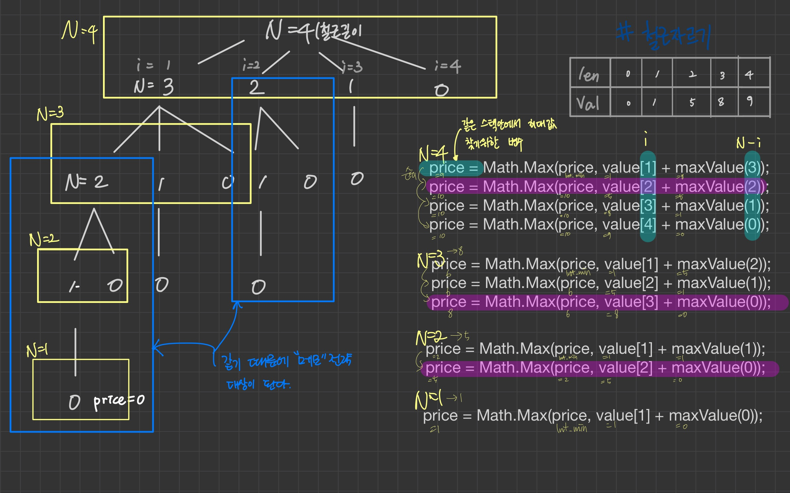
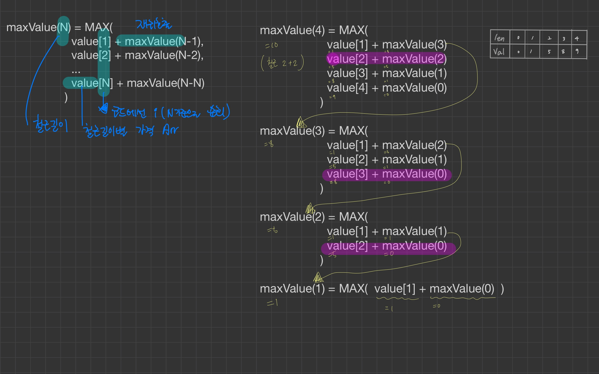

# 8. 철근 자르기

## 재귀 문제 풀이 로직
```
  maxValue(N) = MAX(
  value[1] + maxValue(N-1),
  value[2] + maxValue(N-2),
  ...
  value[N] + maxValue(N-N)
  )
```

## 재귀 문제 풀이 로직 예) maxValue(4)

```
  maxValue(4) = MAX(
  value[1] + maxValue(3),
  value[2] + maxValue(2),
  value[3] + maxValue(1),
  value[4] + maxValue(0)
  )

  maxValue(3) = MAX(
  value[1] + maxValue(2),
  value[2] + maxValue(1),
  value[3] + maxValue(0)
  )

  maxValue(2) = MAX(
  value[1] + maxValue(1),
  value[2] + maxValue(0)
  )

  maxValue(1) = MAX( value[1] + maxValue(0) )
```

## 재귀 문제 풀이 실제 예) recursive 호출시 maxValue(4) 일때 호출되는 코드 
* maxValue(4) 일때 for문 순회 안에서 호출되는 코드
  ```
    price = Math.Max(price, value[1] + maxValue(3));
    price = Math.Max(price, value[2] + maxValue(2));
    price = Math.Max(price, value[3] + maxValue(1));
    price = Math.Max(price, value[4] + maxValue(0));
  ```
* maxValue(3) 일때 for문 순회 안에서 호출되는 코드
  ```
    price = Math.Max(price, value[1] + maxValue(2));
    price = Math.Max(price, value[2] + maxValue(1));
    price = Math.Max(price, value[3] + maxValue(0));
  ```

* maxValue(2) 일때 for문 순회 안에서 호출되는 코드
  ```
    price = Math.Max(price, value[1] + maxValue(1));
    price = Math.Max(price, value[2] + maxValue(0));
  ```
* maxValue(1) 일때 for문 순회 안에서 호출되는 코드
  ```
    price = Math.Max(price, value[1] + maxValue(0));
  ```


# 도식표



