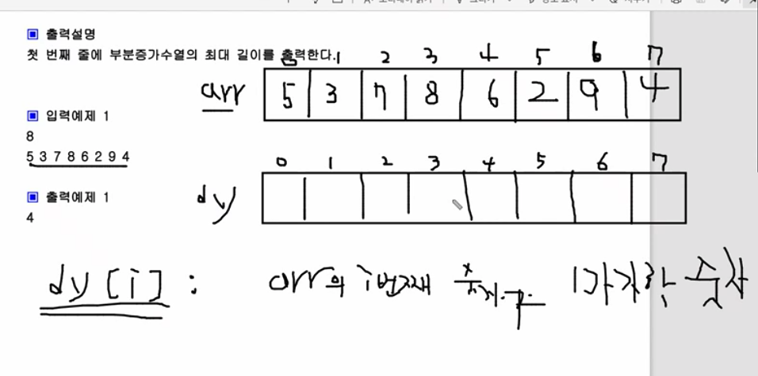
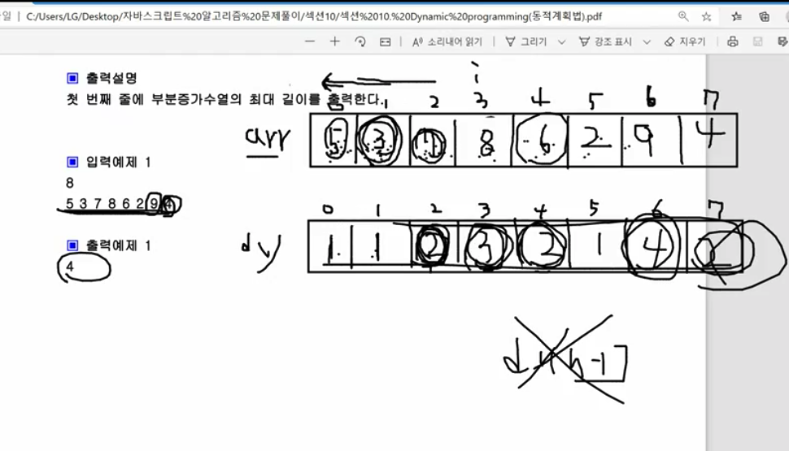

* <u>dy[i]: arr의 i번째 숫자가 마지막 증가수열의 길이</u>
* arr의 index가 3일때 값을 8이다
  * 그래서 dy배열 index 3일때는 최대부분증가수열 마지막 숫자가 8일때 LIS를 구하는 것이다.



* i,j index가 순회 하면서
* i index 선택된 인덱스 이전에 값을 순회(j) 하면서 선택된 인덱스보다 작은 값중에 dy가 높은것 +1 한다.
  * j가 i index 선택된 인덱스 이전에 값을 순회한다.
    * 예를들어 i가 3이면 j가 2,1,0을 순회 하면서 값을 비교한다.


* #🌟POINT
  * arr배열 index i가 3일때 값은 8이다.
  * 8일때 이전에 숫자는 8보다 작으면서 가장 큰숫자가 와야 한다.
    ```js
    if (arr[j] < arr[i] && dy[j] > max) {
      max = dy[j];
    }
    ```
    * 그래서 위조건에 해당하는 것은 index 2인 숫자는 7이다.
    * arr배열의 index 2가 7일때의 최대부분증가수열(LIS)가 2이기 때문에
    * dy[2] + 1을 해준다.
      ```js
        dy[i] = max + 1;
      ```


* #🌟POINT 추가 설명
  * arr 배열 index i가 4일때 값은 6이다.
  * 최대부분증가수열은 6보다 작으면서 최대 숫자의 dy + 1해줘야 한다.
  * 그래서 6보다 작으면서 최대 숫자는 5이다.
  * 배치된 수열의 5는 LIS가