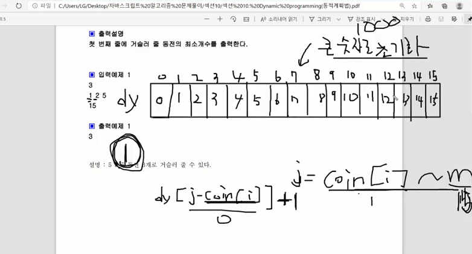
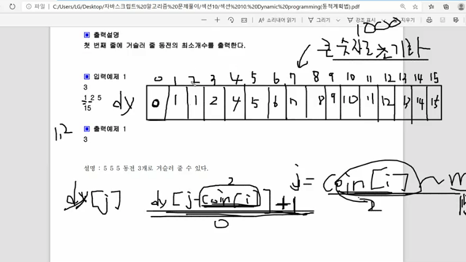

* 1원만 사용했을때 거스름 돈 갯수



---
* 2원을 사용했을때 거스름돈 갯수를 보자
  - index 2를 보면 기존에는 2가 있었다.
  - 2원을 사용했을때 2원을 거스르는건 동전 2원짜리 1개면 된다.
    - d[2 - coin[1]] + 1 = dy[0] + 1 = 0 + 1
    - coint = [1,2,5]
    ```js
    dy[j] = Math.min(dy[j], dy[j - coin[i]] + 1);
    ```
    