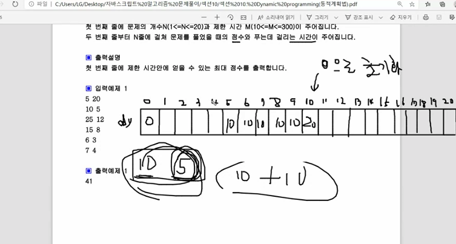
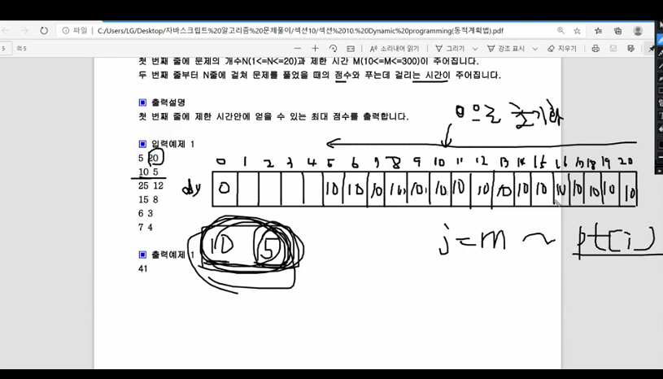
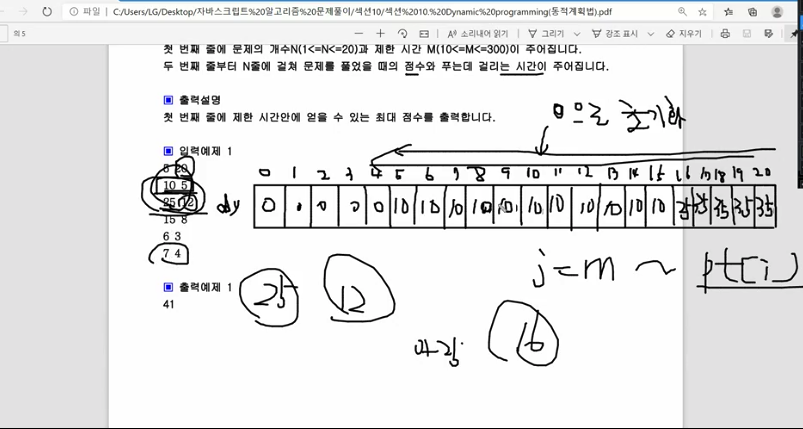

* 정방향으로 순회 햇을때
  * 10점짜리 5분만에 풀은 문제를 봤을때
    * 5에 10이 할당 된다.
    * 10에 20이 할당 된다.
    * 이렇게 되면 1분제를 중복으로 계산 했기 때문에 이 방법은 옳지 않다.
  * 동전교환처럼 정방향으로 순회를 하면 답을 찾기 어렵다.

---
# 의미
  * dy 배열 idx === 분
  * dy 배열 값 점수

---
* 10점짜리 5분걸리는 문제 풀었을 때
  - 역뱡향으로 순회했을때
  - dy배열 각 인덱스(idx === 분)에 모두 10으로 초기화 된다.
  - 5번째 index(=5분)

---
* 25점짜리 12분 걸리는 문제 풀었을때
  - 17,18,19,20분 일때는 5분만에 푼 문제10을 더해서 35가된다.
  - 16분일때는 16-12 = 4분 일때는 풀은 문제가 없다. 그래서 12분만에 풀수 있는 25점이 할당된다.

---
i = 0
                              🌟
              [0, 1, 2, 3, 4,  5,  6,  7,  8,  9, 10, 11, 12, 13, 14, 15, 16, 17, 18, 19, 20]
[10점, 5분]  / [0, 0, 0, 0, 0, 10, 10, 10, 10, 10, 10, 10, 10, 10, 10, 10, 10, 10, 10, 10, 10]

i = 1
                                                          🌟   🌟  🌟  🌟  🌟   🌟  🌟   🌟  🌟
              [0, 1, 2, 3, 4,  5,  6,  7,  8,  9, 10, 11, 12, 13, 14, 15, 16, 17, 18, 19, 20]
[25점, 12분] / [0, 0, 0, 0, 0, 10, 10, 10, 10, 10, 10, 10, 25, 25, 25, 25, 25, 35, 35, 35, 35]

i = 2                                     🌟   🌟  🌟  🌟                                   🌟
              [0, 1, 2, 3, 4,  5,  6,  7,  8,  9, 10, 11, 12, 13, 14, 15, 16, 17, 18, 19, 20]
[15점, 8분]  / [0, 0, 0, 0, 0, 10, 10, 10, 15, 15, 15, 15, 25, 25, 25, 25, 25, 35, 35, 35, 40]

i = 3                                     🌟   🌟  🌟  🌟               🌟  🌟               🌟
              [0, 1, 2, 3, 4,  5,  6,  7,  8,  9, 10, 11, 12, 13, 14, 15, 16, 17, 18, 19, 20]
[6점, 3분]   / [0, 0, 0, 6, 6, 10, 10, 10, 16, 16, 16, 21, 25, 25, 25, 31, 31, 35, 35, 35, 41]

i = 4                                 🌟       🌟  🌟                                  🌟
              [0, 1, 2, 3, 4,  5,  6,  7,  8,  9, 10, 11, 12, 13, 14, 15, 16, 17, 18, 19, 20]
[7점, 4분]   / [0, 0, 0, 6, 7, 10, 10, 13, 16, 17, 17, 21, 25, 25, 25, 31, 32, 35, 35, 38, 41]