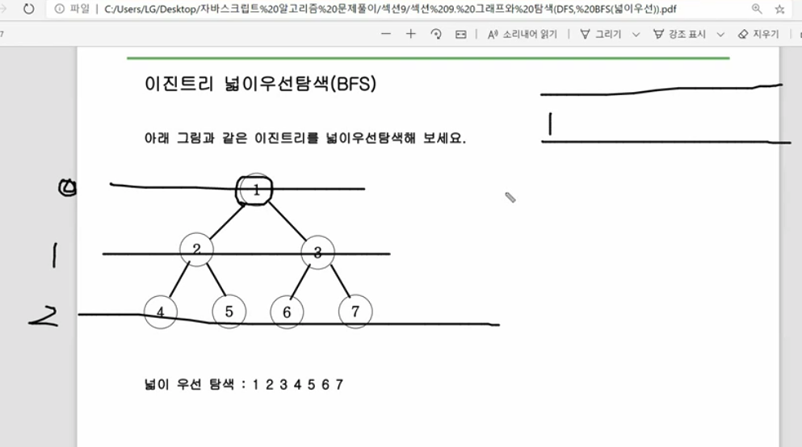
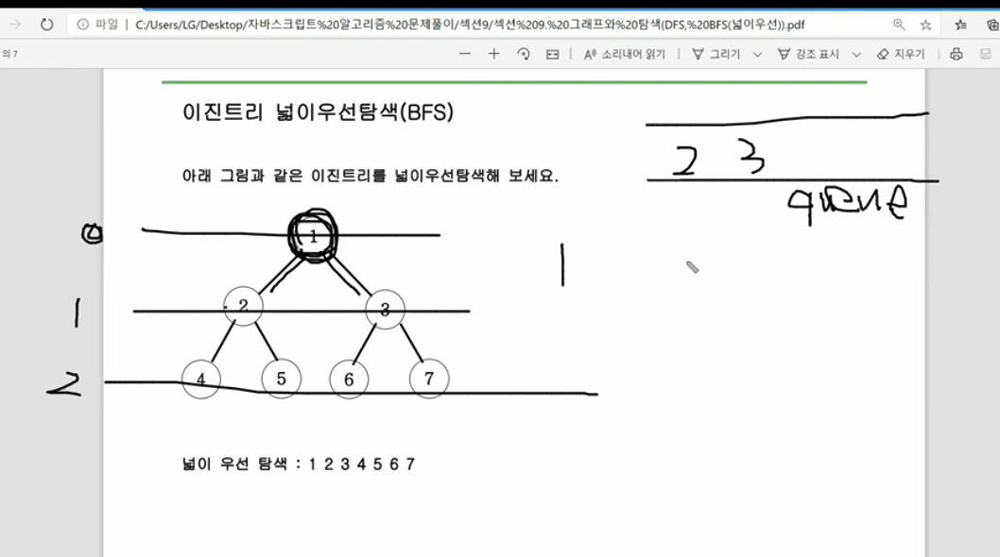
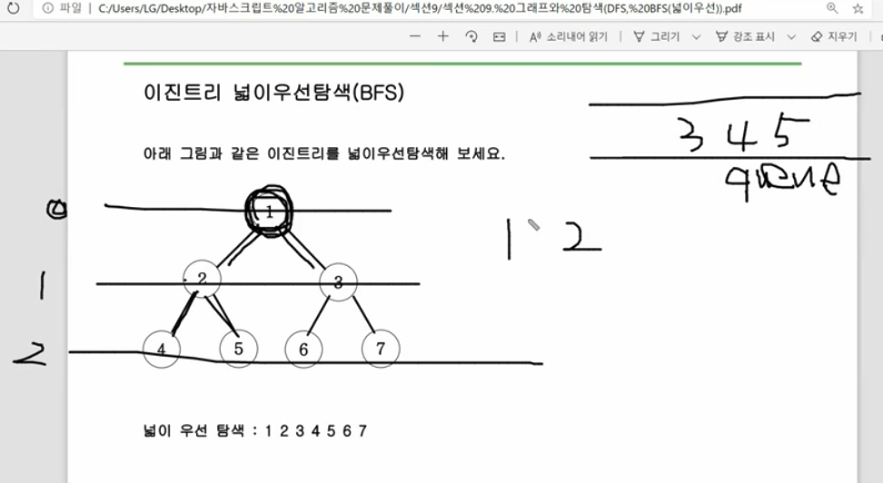
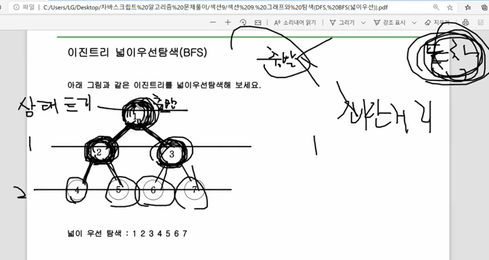

# BFS란?

* 과정 1 - 1을 넣는다.
    * queue에 1을 넣는다.

* 과정 2 - 1을 빼면서(shift) 1의 자식노드를 queue에 넣는다.
    * 1을 빼면서 1의 자식노드 2, 3을 queue에 넣는다.
    * 이진트리 특성으로 1*2, 1*2+1 값을 넣는 것이다.

* 여기서 부터 위 1,2 과정이 반복
* 결국 2번과정에서 shift 한값을 차례로 나열하면 2진 트리의 를 너비 우선탐색하는(bfs) 과정이 된다.

# 어디에서 사용되는걸까?

* 상태트리라고 부른다.
* 출발지점에서 도착지점으로 가는데 출발지점에 여러가지 길이 있는데 <u>도착지에 가는 최단거리를 구할때 사용된다.</u>

* <u>아래 상태트리를 최소 거리 가는데 몇번 이동해서 찾을 수 있는지에 대해서 설명해보겠다.</u>
    * 1번 움직일때(level1)는 2,3 위치로 갈수 있다.
    * 2번 움직일때(level2)는 4,5,6,7 위치로 갈수 있다.
    * 그래서 만약 1번에서 5번위치까지 갈때 최소 이동은 2번이다.

