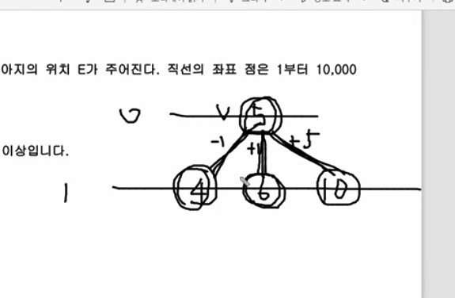
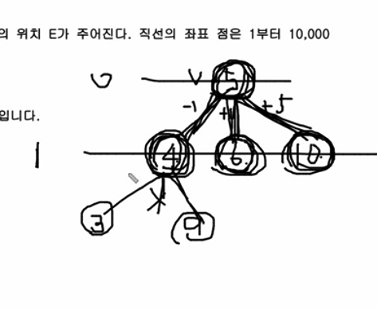
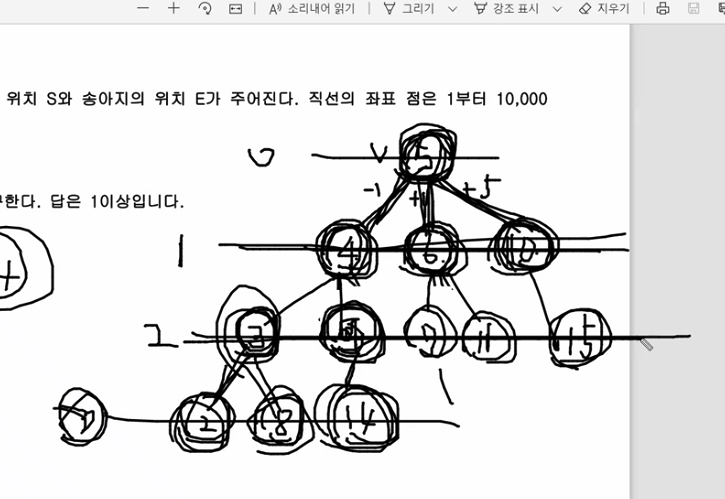
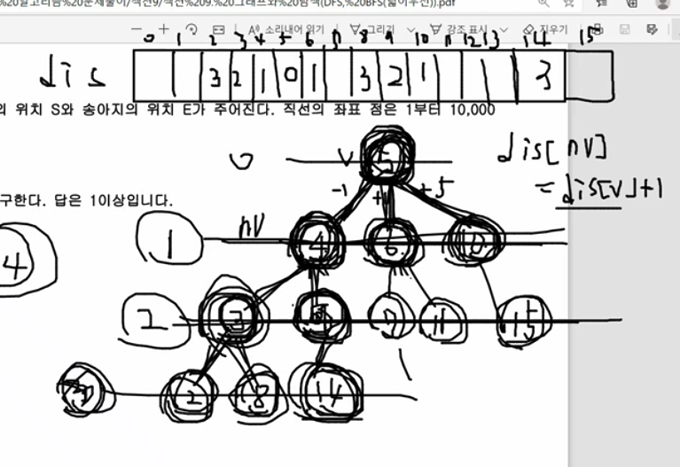

# 문제풀이

* 0레벨에서 한번에 갈수 있는 위치는 4,6,10 이다.

---

* 2번째 레벨검색할때 1번재 레벨에서 사용한 것은 사용하지 않는다.
    * 그래야 시간복잡도가 줄어든다.

---

* 레벨3의 왼쪽에서 3번째 값이 14가 처음 발견된다. 그러면 최소이동횟수는 3번이다.

---

* dis라는 배열을 보자
    * 이 배열은 idx는 위치고 값은 5번에서 몇번 움직였을때 이동한 횟숫다.
