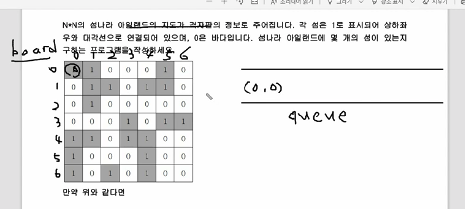
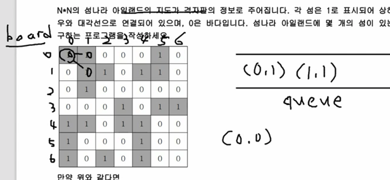
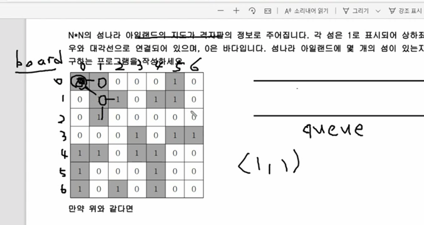
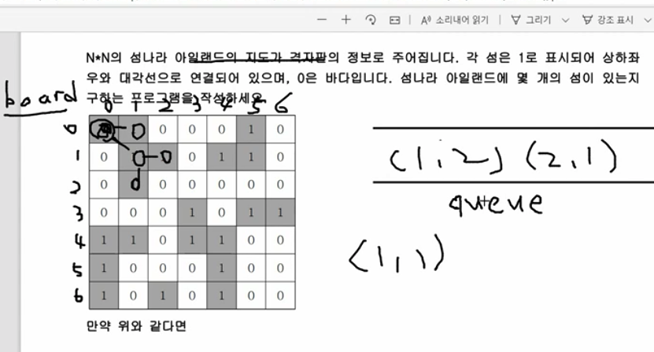
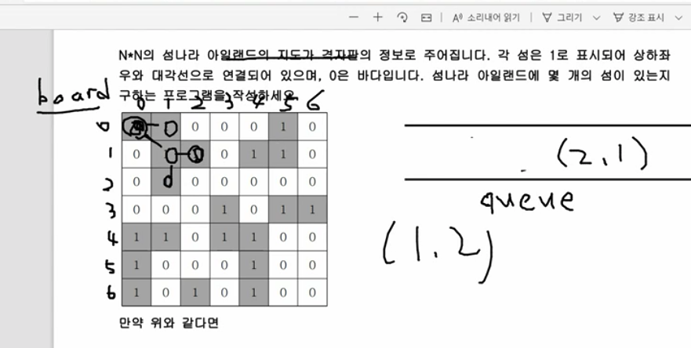
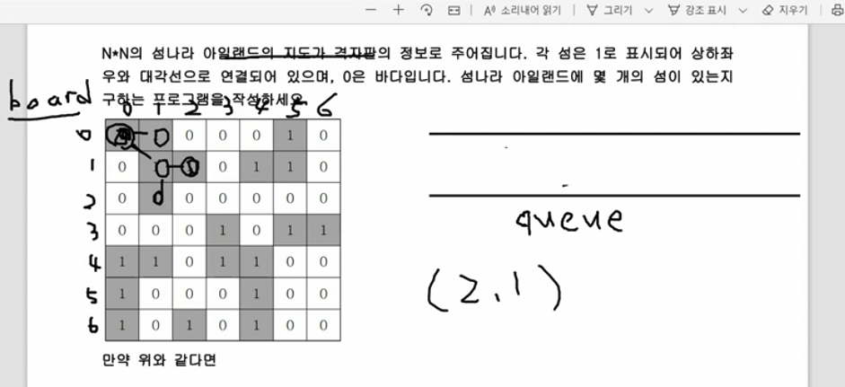

* DFS에서는 재귀호출을 통해서
* 이번에는 BFS queue를 통해서 문제를 풀어본다.

---

* (0,0)을 0으로 만들고
* (0.0)을 queue에 넣는다.

---

* (0,1) (1,1)을 queue에 넣으면서 1을 0으로 만든다.(그래야 도달했었다는것을 알 수 있다.)
    * 그렇지 않고 나왔을때 1을 넣으면 (0,1)

---

* 위 내용이 반복된다.
