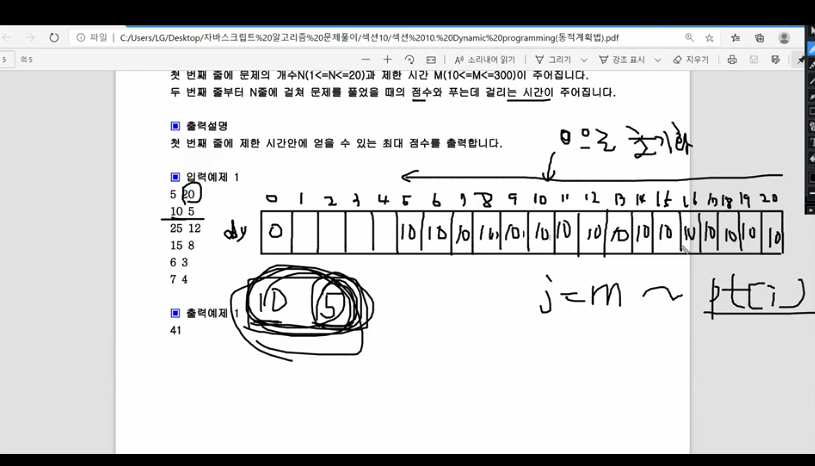

* 정방향으로 순회 햇을때
  * 10점짜리 5분만에 풀은 문제를 봤을때
  * 5에 10이 할당 된다.
  * 10에 20이 할당 된다.
  * 이렇게 되면 1분제를 중복으로 계산 했기 때문에 이방법은 옳지 않다.

---
* 10점짜리 5분걸리는 문제 풀었을때
  - 10으로 모두 초기화 된다. 5번재 index(=5분)

---
* 25점짜리 12분 걸리는 문제 풀었을때
  - 17,18,19,20분 일때는 5분만에 푼 문제10을 더해서 35가된다.
  - 16분일때는 16-12 = 4분 일때는 풀은 분제가 없다. 그래서 12분만에 풀수 있는 25점이 할당된다.
