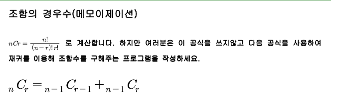

* 위 사진 의미
* 만약에 1,2,3,4,5 집합이 있을때
    * 3개를 뽑아서 만들수 있는 조합의 수는 5C3 = 10개 이다.
    * 이때 예를 들어 5를 넣었을때와 넣지 않았을때 를 살펴보자
    * 5가 있는, 없는 조합을 만들수 있다.
        * {x,x,5}, {x,x,x}
    * 그래서 즉 5C3 = 4C2+4C3이 된다.
